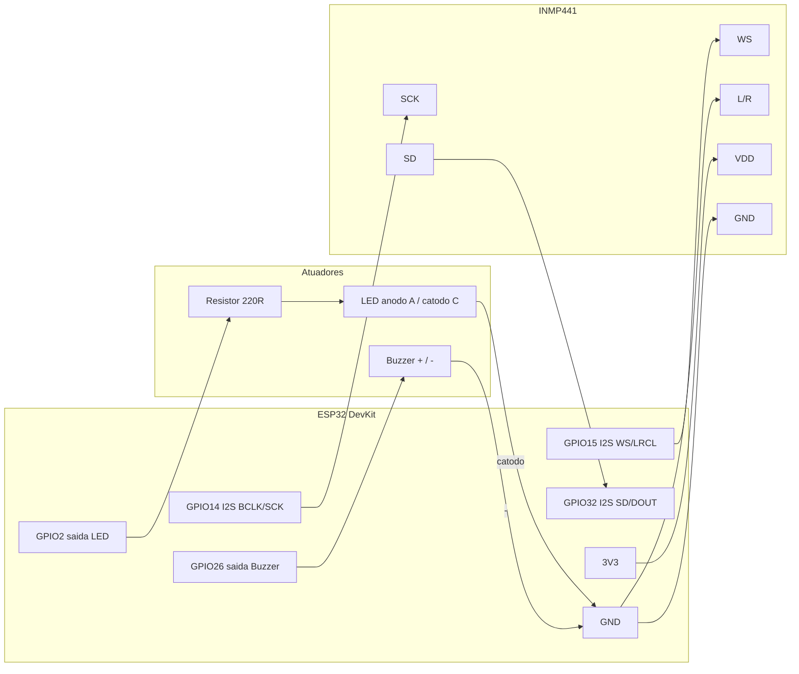
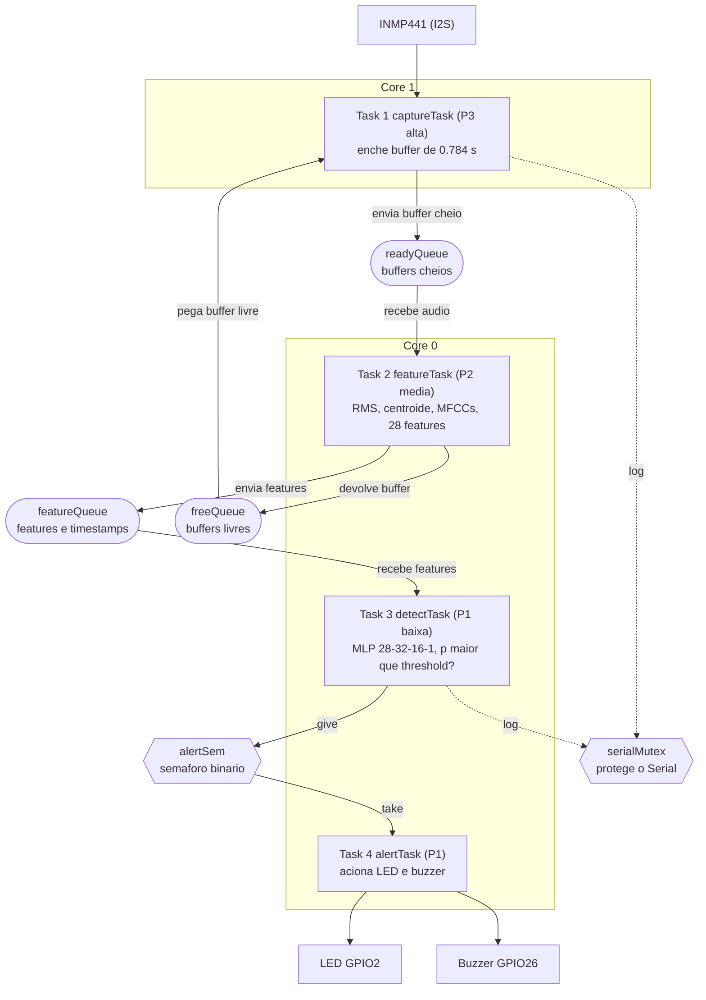

# Diagramas do Detector de Bem-te-vi

Este arquivo traz o mapa de ligações (o que conectar em cada porta) e o diagrama
de tarefas do RTOS com filas, mutex e semáforo binário. A versão em imagem do
diagrama de tarefas está em [`rtos_diagram.svg`](rtos_diagram.svg).

---

## 1. Pinout, o que ligar em cada porta

### Hardware real (ESP32 + INMP441 + LED + buzzer)



Tabela de ligações do hardware real.

| ESP32   | Componente        | Pino               | Observação                          |
|---------|-------------------|--------------------|-------------------------------------|
| GPIO14  | INMP441           | SCK (BCLK)         | Clock serial I2S                    |
| GPIO15  | INMP441           | WS (LRCL)          | Word select                         |
| GPIO32  | INMP441           | SD (DOUT)          | Dados do microfone para o ESP32     |
| 3V3     | INMP441           | VDD                | Alimentação de 3.3 V                |
| GND     | INMP441           | GND                | Terra                               |
| GND     | INMP441           | L/R                | L/R no GND seleciona o canal esquerdo |
| GPIO2   | Resistor 220 Ω → LED | anodo (A)       | LED de alerta                       |
| GND     | LED               | catodo (C)         | Retorno do LED                      |
| GPIO26  | Buzzer            | positivo           | Tom gerado por LEDC                 |
| GND     | Buzzer            | negativo           | Retorno do buzzer                   |

O INMP441 usa 3.3 V, nunca 5 V. O pino `L/R` aterrado faz ele responder no canal
esquerdo, que é o que o firmware lê com `I2S_CHANNEL_FMT_ONLY_LEFT`.

### Wokwi (simulação, sem microfone)

O Wokwi não injeta áudio real no I2S, então o firmware compila com `WOKWI_SIM=1`
e reproduz um trecho real de bem-te-vi embutido. Dois botões escolhem o sinal.

| ESP32   | Componente          | Pino    | Função                                     |
|---------|---------------------|---------|--------------------------------------------|
| GPIO4   | Botão "BEM-TE-VI"   | 1.l→GND | Pressionar injeta o canto e deve acender o LED |
| GPIO5   | Botão "RUÍDO"       | 1.l→GND | Pressionar injeta ruído                    |
| GPIO2   | LED (via 220 Ω)     | A / C   | Alerta visual                              |
| GPIO26  | Buzzer              | + / −   | Alerta sonoro                              |

Os botões usam `INPUT_PULLUP`, então apertar leva o pino ao GND e o firmware lê
nível baixo.

---

## 2. Diagrama de tarefas do RTOS

Fluxo de dados, filas, mutex e semáforo binário entre as quatro tarefas.



### Primitivas de sincronização usadas

O projeto usa os três tipos que a atividade pede.

- **Filas.** `freeQueue` e `readyQueue` formam um pool de buffers no padrão
  produtor consumidor. A captura só escreve num buffer que retirou da
  `freeQueue`, e ele só volta a ficar livre depois de processado, então a Task 1
  nunca sobrescreve um buffer que a Task 2 ainda está lendo. A `featureQueue`
  desacopla a extração de features da detecção.
- **Semáforo binário.** `alertSem` sinaliza um evento. A `detectTask` executa
  `xSemaphoreGive` quando termina uma decisão e a `alertTask` fica bloqueada em
  `xSemaphoreTake` até esse sinal. Isso separa a decisão da atuação e tira o
  atraso do bipe de dentro do laço de detecção.
- **Mutex.** `serialMutex` garante exclusão mútua no `Serial`, que é um recurso
  compartilhado. Sem ele os logs de tarefas concorrentes se embaralhariam.

As prioridades (3 acima de 2 acima de 1) fazem o scheduler dar preferência à
captura, que é a etapa que não pode perder amostras. A detecção e a atuação, menos
urgentes, rodam no tempo ocioso.

### Latência medida por etapa

Cada `FeatureMsg` carrega carimbos de tempo (`esp_timer_get_time()`) e a
`detectTask` imprime, por janela, o custo de cada fase.

```
captura   = t_cap_end  - t_cap_start   (~784 ms, duracao inerente da janela)
features  = t_feat_end - t_cap_end     (FFT e MFCC, alguns ms)
deteccao  = t_det_end  - t_feat_end    (forward do MLP, menos de 1 ms)
e2e       = t_det_end  - t_cap_start   (fim a fim)
```
